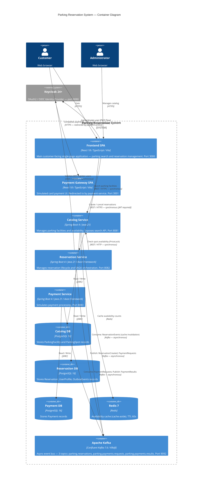

# C4 Container Diagram: Parking Reservation System

```mermaid
C4Container
    title Parking Reservation System — Container Diagram

    Person(customer, "Customer", "Web browser")
    Person(admin, "Administrator", "Web browser")

    System_Ext(keycloak, "Keycloak 24+", "OAuth2 / OIDC Identity Provider — port 8080")

    System_Boundary(parking, "Parking Reservation System") {

        Container(frontend, "Frontend SPA", "React 18 / TypeScript / Vite", "Main customer-facing single-page application — parking search and reservation management. Port 3000")
        Container(payment_gateway, "Payment Gateway SPA", "React 18 / TypeScript / Vite", "Simulated card payment UI. Redirected to by payment-service. Port 3001")

        Container(catalog_service, "Catalog Service", "Spring Boot 4 / Java 21", "Manages parking facilities and availability. Exposes search API. Port 8081")
        Container(reservation_service, "Reservation Service", "Spring Boot 4 / Java 21 / Axon Framework", "Manages reservation lifecycle and SAGA orchestration. Port 8082")
        Container(payment_service, "Payment Service", "Spring Boot 4 / Java 21 / Axon Framework", "Simulates payment processing. Port 8083")

        ContainerDb(catalog_db, "Catalog DB", "PostgreSQL 16", "Stores ParkingFacility and ParkingSpot records")
        ContainerDb(reservation_db, "Reservation DB", "PostgreSQL 16", "Stores Reservation, UserProfile, OutboxEvents records")
        ContainerDb(payment_db, "Payment DB", "PostgreSQL 16", "Stores Payment records")
        ContainerDb(redis, "Redis 7", "Redis", "Availability cache (cache-aside). TTL 60s")

        Container(kafka, "Apache Kafka", "Confluent Kafka 7.6 / KRaft", "Async event bus — 3 topics: parking.reservations, parking.payments.requests, parking.payments.results. Port 9092")
    }

    Rel(customer, frontend, "Uses", "HTTPS")
    Rel(admin, frontend, "Manages catalog", "HTTPS")
    Rel(customer, payment_gateway, "Completes payment", "HTTPS — redirected by payment-service")

    Rel(frontend, keycloak, "Authenticates user (PKCE flow)", "OIDC / HTTPS — synchronous")
    Rel(frontend, catalog_service, "Search parking facilities", "REST / HTTPS — synchronous")
    Rel(frontend, reservation_service, "Create / cancel reservations", "REST / HTTPS — synchronous (JWT required)")

    Rel(reservation_service, keycloak, "Validate JWT, register users", "OIDC / HTTPS — synchronous")
    Rel(reservation_service, catalog_service, "Check spot availability (PriceLock)", "REST / HTTP — synchronous")

    Rel(reservation_service, kafka, "Publish: ReservationCreated, PaymentRequests", "Kafka — asynchronous")
    Rel(payment_service, kafka, "Consume: PaymentRequests; Publish: PaymentResults", "Kafka — asynchronous")
    Rel(catalog_service, kafka, "Consume: ReservationEvents (cache invalidation)", "Kafka — asynchronous")

    Rel(catalog_service, catalog_db, "Read / Write", "JDBC")
    Rel(catalog_service, redis, "Cache availability counts", "Redis")
    Rel(reservation_service, reservation_db, "Read / Write", "JDBC")
    Rel(payment_service, payment_db, "Read / Write", "JDBC")
```
