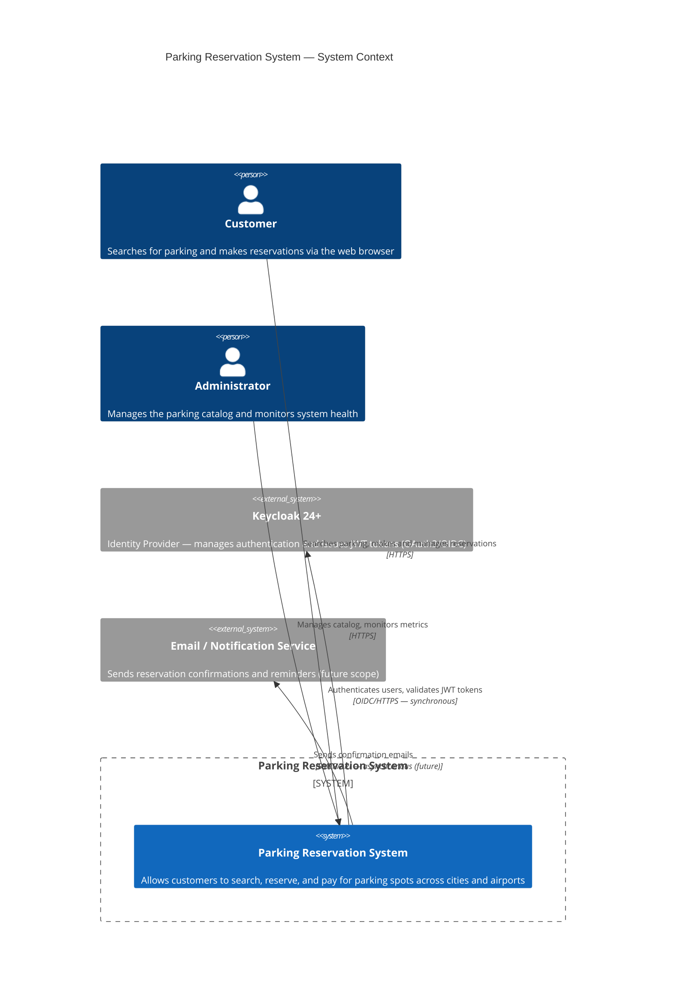

# C4 Context Diagram: Parking Reservation System

```mermaid
C4Context
    title Parking Reservation System — System Context

    Person(customer, "Customer", "Searches for parking and makes reservations via the web browser")
    Person(admin, "Administrator", "Manages the parking catalog and monitors system health")

    System_Boundary(parking, "Parking Reservation System") {
        System(parking_system, "Parking Reservation System", "Allows customers to search, reserve, and pay for parking spots across cities and airports")
    }

    System_Ext(keycloak, "Keycloak 24+", "Identity Provider — manages authentication and issues JWT tokens (OAuth2/OIDC)")
    System_Ext(email, "Email / Notification Service", "Sends reservation confirmations and reminders (future scope)")

    Rel(customer, parking_system, "Searches parking, makes and manages reservations", "HTTPS")
    Rel(admin, parking_system, "Manages catalog, monitors metrics", "HTTPS")
    Rel(parking_system, keycloak, "Authenticates users, validates JWT tokens", "OIDC/HTTPS — synchronous")
    Rel(parking_system, email, "Sends confirmation emails", "SMTP/API — asynchronous (future)")

    UpdateLayoutConfig($c4ShapeInRow="2", $c4BoundaryInRow="1")
```
